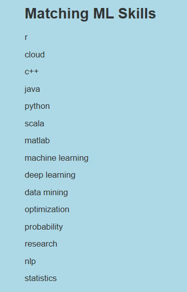
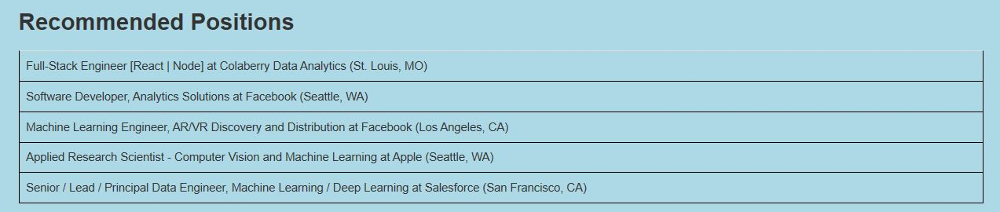

# Job Recommender System using NLP 

### Landing Page

## Description
We wanted to develop a Machine Learning Model using NLP to recommend Jobs for the users/applicants and provide as a service in a Web Application using AWS EC2 instance.

Here are the things we did for this Job recommender System.

- Data Gatherings, we collected Job Postings related to Machine Learning from Stack Overflow.
- Data Cleanup to make sure data is populated in all the postings, valid and relavant to the model.
- Used NLP techniques like tokenization, stop words, POS (Part of Speech) to come up with the key skills from the data/resume entered by 
  the users
- Used Gensim to create a Dictionary and Corpus
- Used the Gensim Corpus to compare the skills of the user and the Corpus (Job Posting) to find similar jobs and recommend it to the  
  users.
- FLASK app to deploy the model and take in the input and recommend the jobs based on the users skills.

## Clone:
* Clone this repo to your local machine using  https://github.com/vgangaprasad/ML_Skills_Match.git

## Tools/Technologies Used:
* NLTK
* GENSIM
* HTML
* Pandas
* Tableau
* Flask
* AWS EC2 to deploy the model.

## Contributors:
* https://github.com/vgangaprasad
* https://github.com/deniscohen43
* https://github.com/SharmaBhumi
* https://github.com/ibawany65 
* https://github.com/congntran92

##Here are some of the images from the Application

### Skills Box (Place where you enter your resume or skills that have)
_in_text_box.JPG)

 

### Matching Skills

 

### Main image - Recommended Jobs

 
